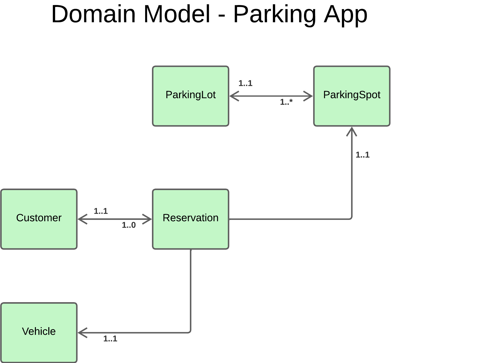
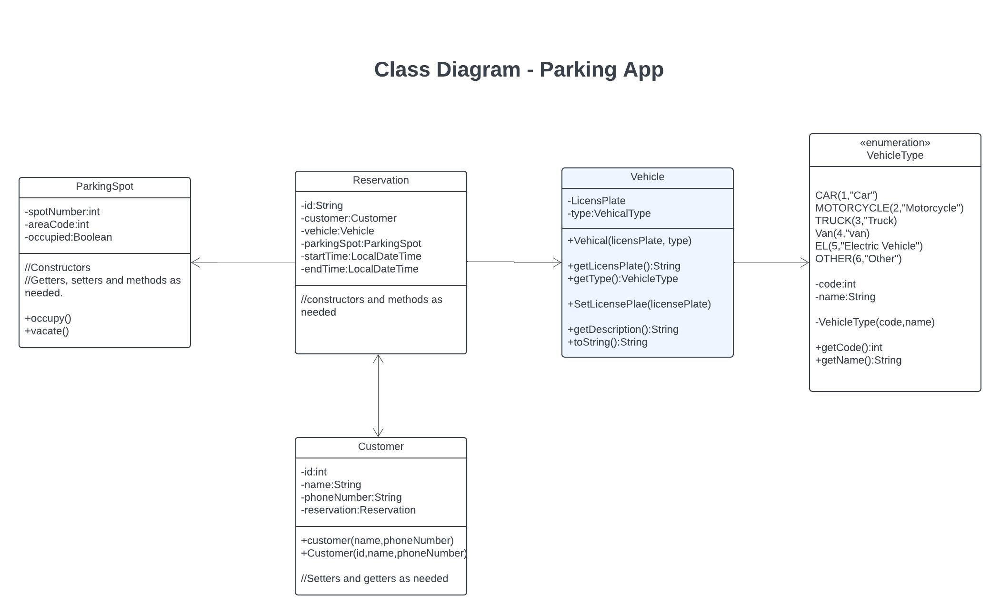

# Parking-App based on oop concepts

## ParkingSpot

- Represents a parking spot with a spot number and a status indicating whether it is occupied or not.
- **Attributes**
    - `spotNumber:int` The identifier for the parking spot.
    - `occupied:Boolean` Indicates if the spot is occupied

## Reservation

- Represents a reservation made by a customer for a parking spot. It includes details such as the reservation id,
  customer, parking spot, start time, end time, and the associated vehicle.
  -**Attributes**
- `id:String` The identifier for the reservation.
- `customer:Customer` The customer who made the reservation.
- `parkingSpot:ParkingSpot` The parking spot that is reserved.
- `startTime:LocalDateTime` The start time of the reservation.
- `endTime:LocalDateTime` The end time of the reservation.
- `associatedVehicle:Vehicle` The vehicle associated with the reservation.

## Vehicle

-Represents a vehicle with a license plate and a type. The type of the vehicle is defined by the VehicleType enum. The
Vehicle class provides methods to get and set the license plate, get the type of the vehicle, and get a description of
the vehicle.
-**Attributes**

- `licensePlate:String` The license plate of the vehicle.
- `type:VehicleType` The type of the vehicle, defined by the VehicleType enum.

## Customer

-Represents a customer who can make a reservation. The details of the customer are not provided in the code excerpts,
but it is likely that this class includes details such as the customer's name and the reservation they have made.
-**Attributes**

- `id:int` The identifier for the customer.
- `name:String` The name of the customer.
- `phoneNumber:String` The phone number of the customer.
- `reservation:Reservation` The reservation made by the customer.

## Domain Model

## Clas diagram

